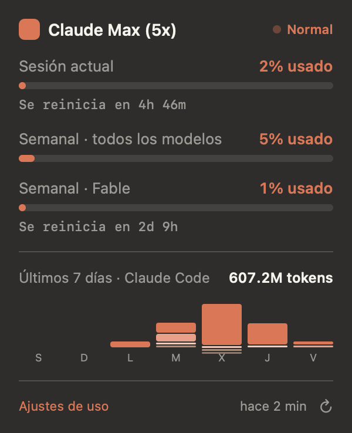
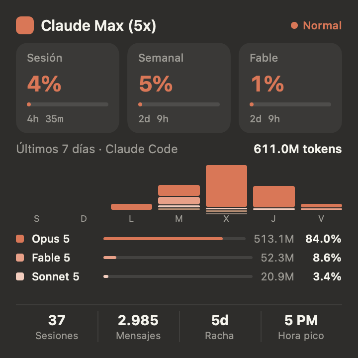
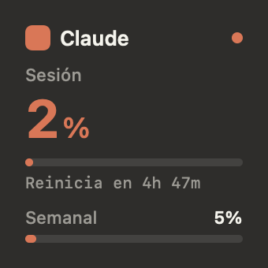
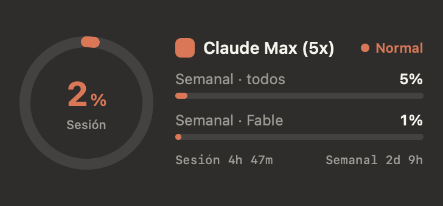

# Claude Usage — widget de macOS

Widget nativo de escritorio más un desplegable en la barra de menú que muestran cuánto has
gastado de tu plan Claude: la ventana de sesión de 5 horas, el límite semanal de todos los
modelos y el límite semanal del modelo que tu cuenta contabilice aparte.

**No hay que pegar ninguna cookie ni crear ningún token.** Si usas Claude Code y tienes la
sesión iniciada, el widget ya tiene todo lo que necesita.

<p align="center">
  
  
</p>
<p align="center">
  
  
</p>

| Pieza | Tamaño | Contenido |
|---|---|---|
| Barra de menú | — | Chispa teñida + % de sesión; al pulsar, las tres barras, el gráfico de 7 días y el enlace a ajustes |
| `systemSmall` | 2×2 | % de sesión en grande, barra, cuenta atrás y barra semanal |
| `systemMedium` | 4×2 | Anillo de sesión, semanal total, semanal por modelo y ambas cuentas atrás |
| `systemLarge` | 4×4 | Tres tiles de límite, gráfico apilado de 7 días, leyenda por modelo y contadores |

## Antes de empezar

- **macOS 14 o posterior**, Apple Silicon o Intel.
- **Claude Code instalado y con sesión iniciada** (`claude` en la terminal). De ahí sale la
  autenticación. Sirve cualquier plan de suscripción — Pro o Max.
- **Command Line Tools que correspondan a tu macOS.** Xcode completo no hace falta, pero
  unas CLT viejas no compilan nada en un sistema nuevo:

  ```sh
  xcrun --show-sdk-version     # debe coincidir con tu versión de macOS
  ```

  Si no coincide, actualízalas:

  ```sh
  sudo softwareupdate -i "Command Line Tools for Xcode 26.6"   # ajusta la versión
  ```

## Instalación

```sh
git clone https://github.com/DiegoRyomaOsaki/claude-usage-widget.git
cd claude-usage-widget
./build.sh
```

El script compila, firma ad-hoc, copia la app a `/Applications` y la registra. Después:

1. **Abre «Claude Usage» una vez.** macOS sólo ofrece un widget cuando su app contenedora
   ya se ha ejecutado. La app no aparece en el Dock: vive en la barra de menú, arriba a la
   derecha, como una chispa con un porcentaje al lado.
2. **Clic derecho en el escritorio → *Editar widgets*** → busca **Uso de Claude** y arrastra
   el tamaño que quieras.

Para instalar sólo para tu usuario, sin tocar `/Applications`:

```sh
INSTALL_DIR=~/Applications ./build.sh
```

### Cómo se usa

- **Clic izquierdo** en la barra de menú: abre el panel.
- **Clic derecho**: menú con *Actualizar ahora*, el interruptor de *Refrescar en segundo
  plano*, los ajustes de uso en claude.ai y *Salir*.

El refresco en segundo plano se instala solo la primera vez: un LaunchAgent que consulta
cada 5 minutos, para que los widgets sigan al día aunque cierres la app.

## Desinstalación

```sh
./uninstall.sh
```

Quita la app, el LaunchAgent y el caché de estado. No toca `~/.claude` ni el llavero: son
de Claude Code, y este widget sólo los lee.

## De dónde salen los datos

Dos fuentes, y la interfaz distingue cuál es cuál porque miden cosas distintas.

**Los límites del plan** vienen de `https://api.anthropic.com/api/oauth/usage`, la misma
información que muestran el comando `/usage` y el panel de claude.ai. La app se autentica
con el token OAuth que **Claude Code ya guarda** en tu llavero, bajo el ítem
`Claude Code-credentials`. Claude Code lo renueva mientras lo usas, así que leerlo en cada
consulta basta.

Nunca se escribe nada de vuelta. Rotar el token de refresco invalidaría la copia de Claude
Code y cerraría tu sesión del CLI, así que un token caducado se reporta como un aviso
—«abre Claude Code una vez»— en lugar de renovarse por su cuenta.

**El histórico de tokens** (gráfico de 7 días, leyenda por modelo y los contadores del pie)
se agrega de los transcripts de Claude Code en `~/.claude/projects/**/*.jsonl`. La API
devuelve porcentajes contra el plan, no tokens, y no dice qué modelo los gastó.

Eso implica un alcance que conviene tener claro, y que la interfaz etiqueta: **el gráfico
cubre Claude Code en este Mac**. Lo que hagas en la web de claude.ai cuenta para las barras
de límite de arriba, pero no deja transcript aquí y por tanto no aparece en el gráfico.

## El modelo que aparece no está fijado en el código

El prototipo de diseño dibujaba «Semanal · Opus». Hoy esta cuenta contabiliza **Fable**
aparte, y mañana puede ser otro modelo.

El widget no elige: `/api/oauth/usage` devuelve un array `limits` con una entrada por
ventana activa, etiquetada `session`, `weekly_all` o `weekly_scoped`, y esta última trae el
nombre del modelo en `scope.model.display_name`. La interfaz imprime ese nombre. Cuando
Anthropic cambie qué modelo tiene presupuesto semanal propio, tu widget lo refleja sin que
tengas que recompilar.

Las claves antiguas de nivel superior (`five_hour`, `seven_day`, `seven_day_opus`,
`seven_day_sonnet`) se siguen leyendo como respaldo por si una cuenta no trae `limits`.

## Qué significa cada número

- **Sesión** — ventana móvil de 5 horas. Es la que corta el trabajo dentro del día.
- **Semanal · todos** — ventana de 7 días sobre todos los modelos.
- **Semanal · \<modelo\>** — el presupuesto semanal propio del modelo que tu cuenta separe.
- **Racha** — días consecutivos con actividad. Topada a 7: no se carga nada más antiguo.
- **Hora pico** — la hora local que más tokens acumuló en la ventana.
- El punto de estado y el tinte de la barra de menú siguen a la **ventana más llena**, no
  sólo a la sesión, para que un semanal casi agotado no pase desapercibido una tarde
  tranquila.

Los umbrales de color son los del prototipo: naranja por debajo del 70 %, ámbar desde el
70 %, rojo desde el 90 %.

## Si algo no funciona

**El widget no aparece en *Editar widgets*.** Abre la app al menos una vez y confirma que
el sistema ve la extensión:

```sh
pluginkit -m -v -i io.diegopuerto.claudeusage.widget
```

Sin resultados, vuelve a registrar la app:

```sh
/System/Library/Frameworks/CoreServices.framework/Frameworks/LaunchServices.framework/Support/lsregister -f "/Applications/Claude Usage.app"
```

**El widget se quedó con datos viejos.** Quítalo del escritorio y vuelve a añadirlo: macOS
a veces conserva el snapshot anterior tras reinstalar.

**Dice que el token caducó.** Abre Claude Code una vez para que lo renueve, y pulsa
*Actualizar ahora*.

**macOS pide permiso para acceder al llavero.** Puede pasar la primera vez. El ítem lo creó
Claude Code y su lista de acceso sólo autoriza en silencio a los binarios que ya conoce.
Elige **Permitir siempre**. En la práctica casi nunca aparece: la app intenta primero una
lectura silenciosa y luego `/usr/bin/security`, que sueles tener ya autorizado, y sólo pide
el diálogo si ambas fallan *y* hay alguien esperando delante. El refresco en segundo plano
nunca lo muestra — fallaría rápido antes que dejar un proceso colgado en un cuadro que
nadie ve.

**Comprobar el estado a mano:**

```sh
# Última consulta y si hubo error
cat "$HOME/Library/Application Support/ClaudeUsageWidget/status.json"

# El LaunchAgent (la segunda columna es el último código de salida; 0 es correcto)
launchctl list | grep claudeusage

# Forzar una consulta
"/Applications/Claude Usage.app/Contents/MacOS/ClaudeUsage" --refresh
```

## Cómo está montado

La extensión del widget nunca toca la red ni el llavero. La app contenedora consulta,
escribe `status.json` y llama a `WidgetCenter.reloadAllTimelines()`; la extensión sólo lee
el archivo. Eso evita los App Groups, que exigirían una identidad de firma de pago.

```
LaunchAgent (5 min) ──▶ ClaudeUsage --refresh ──┬──▶ llavero → api.anthropic.com/api/oauth/usage
                                                └──▶ ~/.claude/projects/**/*.jsonl
                                 │
                                 ├──▶ ~/Library/Application Support/ClaudeUsageWidget/status.json
                                 └──▶ ~/Library/Containers/io.diegopuerto.claudeusage.widget/…/status.json
                                                               │
                                                     ClaudeUsageWidget.appex (sólo lectura)
```

```
Sources/Shared/   Modelo, rutas, tokens de diseño y componentes (los usan app y extensión)
Sources/App/      Llavero, API, agregación local, LaunchAgent, barra de menú
Sources/Widget/   Los tres layouts y el WidgetBundle
Resources/        Info.plist de ambos bundles y los entitlements de la extensión
```

### El flag de compilación no obvio

Una app extension debe entrar por `NSExtensionMain` de Foundation, cosa que Xcode consigue
con `-e _NSExtensionMain` en los flags del linker. Sin él, WidgetKit llega a
ExtensionFoundation sin identidad de extensión y aborta con *Unrecognized extension type*;
la consulta de descriptores de `chronod` muere y purga la extensión. El síntoma es una
ausencia completamente silenciosa de la galería de widgets, sin ningún error visible.

Para confirmar el punto de entrada de cualquier extensión ya compilada:

```sh
nm -u "/Applications/Claude Usage.app/Contents/PlugIns/ClaudeUsageWidget.appex/Contents/MacOS/ClaudeUsageWidget" | grep NSExtensionMain
```

### Por qué un NSPanel y no un NSPopover

El desplegable de la barra de menú es un `NSPanel` flotante colocado a mano ocho puntos bajo
la barra. Un `NSPopover` se ancla a ras del ítem de estado y acaba montado sobre la barra de
menú en lugar de debajo. Los menús desplegables que se ven bien —iStat, Stats— usan un panel
separado, y eso es lo que reproduce este. A cambio hay que cerrarlo a mano: un panel no se
descarta solo al hacer clic fuera, así que lleva un monitor global de eventos.

## Límites conocidos

- WidgetKit dibuja snapshots estáticos: el punto de estado pulsa en el panel, no en el
  widget de escritorio.
- La firma ad-hoc hace la app local. No se puede distribuir el `.app` compilado a otro Mac;
  cada quien clona y ejecuta `./build.sh`. Por eso mismo, un `./build.sh` nuevo cambia el
  hash de la firma, así que una autorización de llavero concedida antes se vuelve a pedir
  una vez.
- El gráfico de 7 días no ve el uso de la web de claude.ai (explicado arriba).
- La racha nunca reporta más de 7 días.

## Crédito

La ruta de datos parte de [ClaudeUsageBar](https://github.com/Artzainnn/ClaudeUsageBar)
(MIT), que resolvió antes qué endpoints reportan el uso y que `Fable` vive dentro de
`limits[]` y no como clave propia. Este proyecto cambia la autenticación —token OAuth del
llavero en lugar de una cookie pegada a mano— y añade los widgets de escritorio y el
histórico local por modelo.

La interfaz porta el prototipo de Claude Design *Claude Usage Widget*
(`8a9ca1c1-6dc8-45be-8ca2-87dca5cad9b4`).
